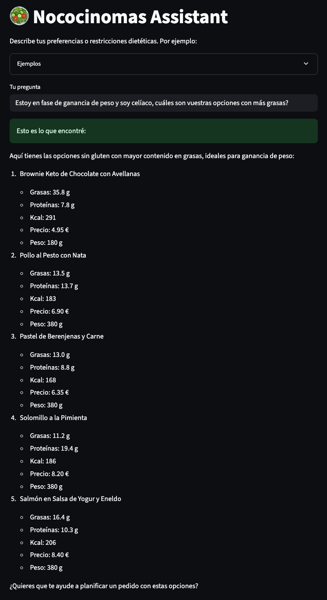
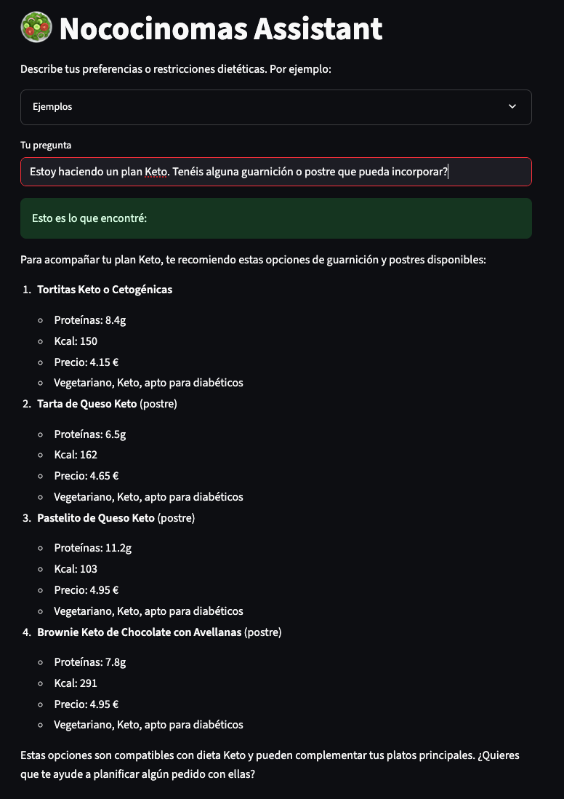
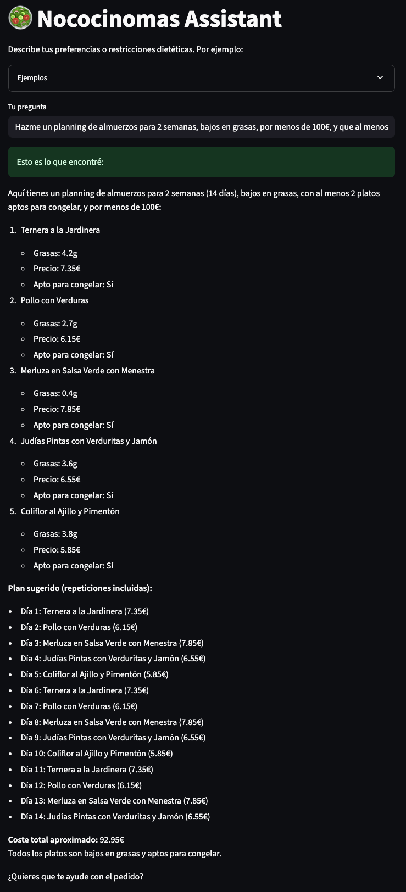
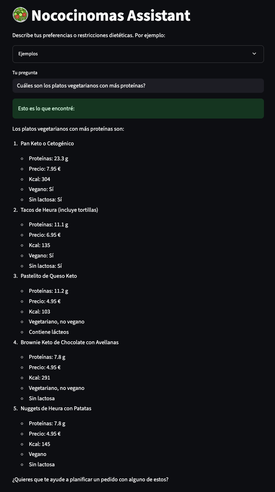

# Nococinomas Assistant

This repository contains the codebase for **Nococinomas Assistant**, a Spanish-language AI-powered dish recommender designed to help users of [nococinomas.es](https://www.nococinomas.es/) choose their weekly meals based on dietary constraints, ingredient preferences, and nutrition goals.

Although the interface and variable names are in English, **both the prompts and the expected input/output are in Spanish**. This is intentional: the original data (menu and ingredient list) is in Spanish, and so are user expectations. While it would have been possible to detect and translate languages using a `langdetect` + Transformers pipeline (e.g., translating from English to Spanish before querying the LLM and vice versa), this was intentionally not done. The app is intended for Spanish-speaking users (where the website delivers), and such machinery would add unnecessary complexity for this use case.

This project was created for **educational purposes and personal use**, as the author is a regular customer of Nococinomas and uses this assistant to plan weekly orders.

---

### 🔗 Live Demo

You can test the live assistant here:  
**👉 [Nococinomas Assistant – Streamlit App](https://smart-tupper-planner-kkqcctszrk9q2ymsjedc8t.streamlit.app/)**  

---

## What This Project Is (and Is Not)

- ❌ This is **not a chatbot**.  
- ✅ It is a **retrieval-based recommendation assistant** that interprets a question and returns relevant dishes.
- ✅ It includes advanced logic for filtering, fallback scoring, and auditing.
- ✅ It combines LLM reasoning and deterministic data science rules.

---

## Folder and File Structure


```
root/
│
├── app.py                      ← Streamlit front-end interface  
├── .env                        ← API keys and environment settings (OpenRouter)  
├── requirements.txt            ← All required packages  
│
├── chroma_db/                  ← Local vector DB (auto-generated on first run)  
│
├── data/  
│   ├── raw.html                ← Downloaded HTML menu from nococinomas.es  
│   └── df_final_official.csv   ← Final annotated dish dataset  
│
├── learnings/                  ← Reflections and lessons from a DS perspective  
│
├── utils/                      ← Modular utilities for backend logic  
│   ├── __init__.py  
│   ├── diet_agent.py           ← LLM agent + fallback logic  
│   ├── diet_rules.py           ← Heuristics and keyword rules for tagging/filtering  
│   ├── html_parser.py          ← HTML parsing and ingredient extraction  
│   └── openai_router_wrapper.py← OpenRouter-compatible wrapper for ChatOpenAI  
│
├── 00_download_and_inspect_html.ipynb   ← Downloads raw HTML and previews dish format  
├── 01_parse_menu.ipynb                  ← Parses dishes from HTML into structured rows  
├── 02_tag_menu_items.ipynb              ← Tags metadata via heuristics and LLM  
├── 03_build_vectorstore.ipynb           ← Builds vector DB using HuggingFace embeddings  
└── 04_tevaluating_assistang.ipynb       ← Evaluates alignment of assistant responses  
```


> Many scripts are implemented as notebooks rather than pure `.py` files because this is a **data science-first project**. Explorability, intermediate validations, and the ability to view outputs inline take priority during development, especially when constructing or validating tagging logic or embedding similarity.

---

## 🧠 Data Science Contributions and Highlights

This project reflects significant **data science thinking and engineering** beyond just using an LLM:

---

### 📓 Notebooks and What They Do

Many components are implemented as notebooks rather than scripts. This is **intentional**: they enable interactive debugging, rich visualization, and iterative logic refinement — all essential in real-world prototyping. Reusability is ensured by wrapping shared logic into utility modules.

| Notebook                     | Purpose                                                                 |
|-----------------------------|-------------------------------------------------------------------------|
| `00_download_and_inspect_html.ipynb` | Downloads and visually inspects the raw HTML menu from nococinomas.es.       |
| `01_parse_menu.ipynb`                | Parses dish names, ingredients, and nutrition info into a structured DataFrame. |
| `02_tag_menu_items.ipynb`           | Applies deterministic and LLM-based rules to tag dietary attributes and filters. |
| `03_build_vectorstore.ipynb`        | Creates a local Chroma vector DB embedding dish descriptions + tags.            |
| `04_evaluating_assistant.ipynb`     | Tests assistant’s filter alignment vs. expected logic using structured metrics. |

---

### 🧩 Intelligent System Design

#### 1. Filter Logic, Fallbacks, and Scoring

When the assistant can't infer high-confidence filters from a user prompt (e.g. vague or noisy queries), the system falls back to **rule-based tagging**. It searches dishes using keyword/tag matching and scores each candidate based on:

- **Boolean tag alignment** (e.g. `is_vegano`, `sin_gluten`)
- **Soft numerical thresholds** (e.g. kcal < 500, proteínas > 20g)
- **Penalty weights** for partial or inverse matches

This fallback scoring is **tunable**, **interpretable**, and **grounded in business logic**, unlike opaque LLM outputs. It ensures robustness even when the model underperforms.

#### 2. Heuristics + LLM = Best of Both Worlds

In `02_tag_menu_items.ipynb`, each dish is tagged via two parallel systems:

- **Heuristics**: Deterministic rules based on string matching and ingredient analysis
- **LLM agent**: Extraction of attributes via prompted reasoning

This hybrid system allows:

- **Validation of agent predictions**
- **Robustness fallback** when LLM fails
- **Business rule enforcement** via hardcoded overrides

#### 3. Personalization & Rule-Based Overrides

The tagging logic includes handcrafted features (e.g. `para_diabeticos`, `de_cuchara`) that go **beyond model inferences**. These are injected during preprocessing or fallback, allowing:

- Precise control over domain-specific labels
- Adaptability to future menu changes
- Elimination of hallucination risks by anchoring logic in real data

#### 4. Evaluation and Testing

The assistant isn’t evaluated with just precision/recall or BLEU-style matching.

In `04_evaluating_assistant.ipynb`, we evaluate **intent alignment**:

- The true expected filters from a user query are defined.
- The assistant’s inferred filters are parsed from its reasoning trace.
- Structural comparison is performed (e.g. tag sets, value ranges), enabling:

  - Detection of false positives/negatives
  - Bias or hallucination tracing
  - Debugging of ambiguous interpretations

This goes **beyond surface-level comparison** and aligns with how real-world assistants must be audited for business-critical workflows.

#### 5. Controlled Retrieval Pre-Fallback

Before triggering fallback logic, the vector search layer can be **pre-conditioned** with inferred metadata or semantic cues:

- `"económicos y saludables"` may prioritize `precio < 6€` and `bajo_en_calorias`
- `"gourmet vegano"` narrows to `is_vegano` and `is_gourmet`
- `"congelable para toda la semana"` expands the match to `congelar = True` and meal diversity

This allows **midway correction** and intelligent broadening or narrowing of the search, increasing relevance without requiring LLM re-prompting.
This kind of **interpretable, hybrid control** is key when deploying GenAI in production—and comes naturally from a data science mindset.

---

## Streamlit Deployment

The project includes a lightweight **Streamlit front-end** (`app.py`) to make the assistant accessible to non-technical users. The UI is intentionally simple and human-friendly, allowing anyone to:

- Ask dietary questions in natural language.
- Receive curated dish recommendations with reasoning.
- Debug unexpected results via structured fallbacks (optional in dev mode).

### Key Features of the UI

- **Real-time inference** with visual feedback and status messages.
- **Multilingual-friendly input**, adapted for Spanish dietary expressions.
- **Expandable examples** to guide user prompts.
- **Backend integration** via a modular `get_answer_to_question()` function.

The app is ideal for demoing or embedding into internal tools, and can be deployed via:

- Local execution (`streamlit run app.py`)
- Sharing via `Streamlit Community Cloud`
- Embedding in web portals (via iframe or wrapper)

---

### 🖼️ Visual Preview (In Case Demo is Unavailable)

In case the assistant becomes temporarily inaccessible — for example, if the current OpenAI API key runs out of credits — we include **screenshot previews** of the assistant’s functionality below.

Each screenshot is fully translated into English to illustrate the assistant’s input, reasoning, and output.

---

#### 📸 Screenshot 1 – Gluten-free high-fat meals for weight gain



**User input:**  
"I'm in a weight gain phase and have celiac disease. What are your highest-fat options?"

**Assistant output:**  
Here are your gluten-free options with the highest fat content, ideal for weight gain:

1. **Keto Chocolate Hazelnut Brownie**
   - Fat: 35.8 g  
   - Protein: 7.8 g  
   - Calories: 291  
   - Price: €4.95  
   - Weight: 180 g  

2. **Chicken with Creamy Pesto**
   - Fat: 13.5 g  
   - Protein: 13.7 g  
   - Calories: 183  
   - Price: €6.90  
   - Weight: 380 g  

3. **Eggplant and Meat Casserole**
   - Fat: 13.0 g  
   - Protein: 8.8 g  
   - Calories: 168  
   - Price: €6.35  
   - Weight: 380 g  

4. **Pepper Steak**
   - Fat: 11.2 g  
   - Protein: 19.4 g  
   - Calories: 186  
   - Price: €8.20  
   - Weight: 380 g  

5. **Salmon with Yogurt and Dill Sauce**
   - Fat: 16.4 g  
   - Protein: 10.3 g  
   - Calories: 206  
   - Price: €8.40  
   - Weight: 380 g  

Would you like help planning an order with these options?

---

#### 📸 Screenshot 2 – Keto-compatible side dishes and desserts



**User input:**  
"I'm on a Keto diet. Do you have any side dishes or desserts I can add?"

**Assistant output:**  
To support your Keto plan, I recommend the following side dishes and desserts:

1. **Keto or Ketogenic Pancakes**
   - Protein: 8.4 g  
   - Calories: 150  
   - Price: €4.15  
   - Vegetarian, Keto, diabetic-friendly  

2. **Keto Cheesecake (dessert)**
   - Protein: 6.5 g  
   - Calories: 162  
   - Price: €4.65  
   - Vegetarian, Keto, diabetic-friendly  

3. **Mini Keto Cheesecake (dessert)**
   - Protein: 11.2 g  
   - Calories: 103  
   - Price: €4.95  
   - Vegetarian, Keto, diabetic-friendly  

4. **Keto Chocolate Hazelnut Brownie (dessert)**
   - Protein: 7.8 g  
   - Calories: 291  
   - Price: €4.95  
   - Vegetarian, Keto, diabetic-friendly  

These options are compatible with a Keto diet and can complement your main dishes. Would you like help planning an order?

---

#### 📸 Screenshot 3 – 2-week low-fat lunch plan under €100



**User input:**  
"Create a 2-week lunch plan, low in fat, under €100, and with at least 2 meals suitable for freezing. I don’t mind repeating meals."

**Assistant output:**  
Here’s a 2-week (14-day) lunch plan, low in fat, with at least 2 freeze-friendly dishes, under €100:

1. **Beef with Vegetables**
   - Fat: 4.2 g  
   - Price: €7.35  
   - Freezer-friendly: Yes  

2. **Chicken with Vegetables**
   - Fat: 2.7 g  
   - Price: €6.15  
   - Freezer-friendly: Yes  

3. **Hake in Green Sauce with Vegetables**
   - Fat: 0.4 g  
   - Price: €7.85  
   - Freezer-friendly: Yes  

4. **Pinto Beans with Veggies and Ham**
   - Fat: 3.6 g  
   - Price: €6.55  
   - Freezer-friendly: Yes  

5. **Cauliflower with Garlic and Paprika**
   - Fat: 3.8 g  
   - Price: €5.85  
   - Freezer-friendly: Yes  

**Suggested plan (with repetitions):**

- Day 1: Beef with Vegetables (€7.35)  
- Day 2: Chicken with Vegetables (€6.15)  
- Day 3: Hake in Green Sauce with Vegetables (€7.85)  
- Day 4: Pinto Beans with Veggies and Ham (€6.55)  
- Day 5: Cauliflower with Garlic and Paprika (€5.85)  
- Day 6: Beef with Vegetables (€7.35)  
- Day 7: Chicken with Vegetables (€6.15)  
- Day 8: Hake in Green Sauce with Vegetables (€7.85)  
- Day 9: Pinto Beans with Veggies and Ham (€6.55)  
- Day 10: Cauliflower with Garlic and Paprika (€5.85)  
- Day 11: Beef with Vegetables (€7.35)  
- Day 12: Chicken with Vegetables (€6.15)  
- Day 13: Hake in Green Sauce with Vegetables (€7.85)  
- Day 14: Pinto Beans with Veggies and Ham (€6.55)  

**Estimated total cost:** €92.95  
All meals are low in fat and freezer-friendly.  
Would you like help placing your order?

---

#### 📸 Screenshot 4 – Vegetarian meals with the most protein



**User input:**  
"What are your highest-protein vegetarian meals?"

**Assistant output:**  
Here are the vegetarian meals with the most protein:

1. **Keto or Ketogenic Bread**
   - Protein: 23.3 g  
   - Price: €7.95  
   - Calories: 304  
   - Vegan: Yes  
   - Lactose-free: Yes  

2. **Heura Tacos (includes tortillas)**
   - Protein: 11.1 g  
   - Price: €6.95  
   - Calories: 135  
   - Vegan: Yes  
   - Lactose-free: Yes  

3. **Mini Keto Cheesecake**
   - Protein: 11.2 g  
   - Price: €4.95  
   - Calories: 103  
   - Vegetarian, not vegan  
   - Contains dairy  

4. **Keto Chocolate Hazelnut Brownie**
   - Protein: 7.8 g  
   - Price: €4.95  
   - Calories: 291  
   - Vegetarian, not vegan  
   - Lactose-free  

5. **Heura Nuggets with Potatoes**
   - Protein: 7.8 g  
   - Price: €4.95  
   - Calories: 145  
   - Vegan  
   - Lactose-free  

Would you like help planning an order with any of these?

---


---


# Summary

This assistant is not just a demo of LangChain or embeddings—it’s a **working example of integrating GenAI into a constrained, production-like scenario**, with structured logic, safety checks, testing mechanisms, and data science reasoning behind every step.

Use it, fork it, and feel free to adapt it to your own favorite food delivery site or recipe catalog.

---  
Made with 🧠 by a data scientist tired of scrolling menus on Sunday nights.

---

#  Environment Configuration (`.env`)

This project is configured to work with **[OpenRouter](https://openrouter.ai/)**, a multi-provider LLM gateway that can route requests to models from different providers such as OpenAI, Anthropic, Mistral, etc.

To run the assistant locally, you’ll need to create a `.env` file at the root of your project with the following fields:

```env
OPENROUTER_API_KEY=sk-or-v1-3c...            # Replace with your actual OpenRouter API key
OPENROUTER_BASE_URL=https://openrouter.ai/api/v1
LLM_MODEL=openai/gpt-4.1-mini                # You can change this to any model supported by OpenRouter
```

Also, the code is made for **Streamlit Cloud deployment** that requires a workaround to ensure SQLite compatibility (`pysqlite3`). 

If you're testing locally and encounter issues related to `sqlite3`, make sure to **remove** the following fallback logic from both `app.py` and `tupper_assistant.py`:

```python
__import__('pysqlite3')
import sys
sys.modules['sqlite3'] = sys.modules.pop('pysqlite3')
```


